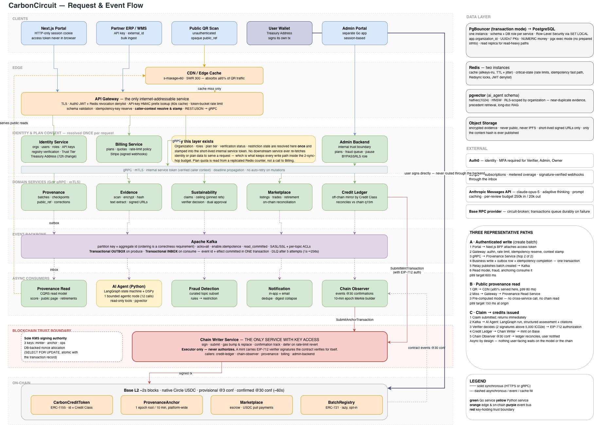
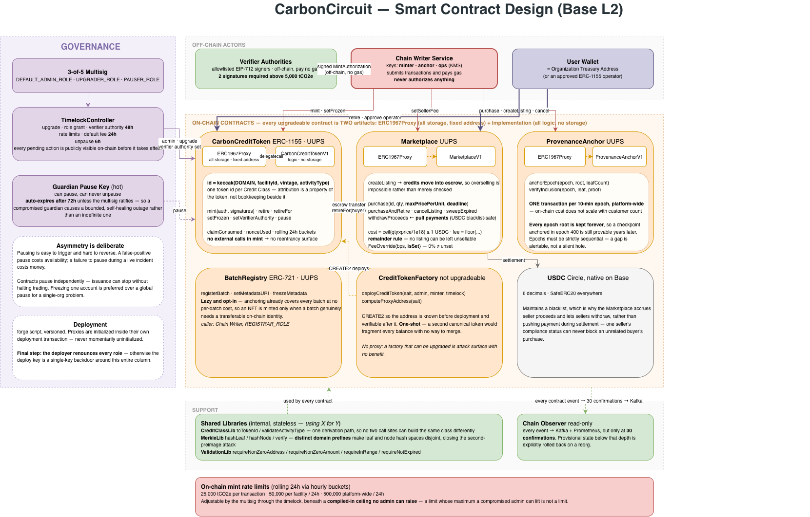

# CarbonCircuit

**A multi-industry supply-chain provenance and carbon credit platform — launching with electronics components.**

CarbonCircuit does two connected things for physical supply chains. It records the verifiable journey of a batch of goods from raw material through manufacturing, assembly, and shipment. And it lets the facilities in that chain have their sustainability practices independently reviewed and converted into carbon credits that other companies can buy, hold, and permanently retire against their own emissions.

Provenance answers *"where did this come from, and is it authentic?"* Carbon credits answer *"how much verified environmental benefit did this facility create, and who now owns it?"*

> **Status — design phase.** This repository currently contains the complete design: product requirements, backend architecture, low-level conventions, smart contract design, and frontend architecture. Implementation has not started. Every document here is written to be built against directly.

---

## Why I'm building this

This is a personal project to build a genuinely production-shaped Web3 system rather than a demo — combining smart contracts, event-driven backend services, and an AI agent embedded in a real workflow instead of a chatbot bolted onto the side.

The problem is real. Electronics supply chains pass through 5–8 facilities across multiple countries with no verifiable way to confirm origin claims. Sustainability claims are usually self-reported with no independent check. And carbon markets globally have a credibility problem driven by credits that could not be traced or were counted twice.

So the system is designed around three properties that are easy to claim and hard to actually deliver:

- **A credit is issued exactly once**, against exactly one approved claim, enforced on-chain rather than by a database row someone could edit.
- **A credit never loses its identity.** Every credit permanently carries the facility that earned it, the year, and the activity type — because a buyer's entire reason for paying is being able to name that in their own ESG report.
- **A retired credit is gone forever.** No resale, no re-transfer, no second retirement.

The design is also explicit about what it *doesn't* guarantee — it cannot detect that the same real-world reduction was also registered with Verra or Gold Standard. That boundary is documented, disclosed to buyers in the product, and mitigated rather than hidden.

---

## Architecture

### System design — request and event flow

Fifteen services across eight domains. Requests enter through a single API Gateway that resolves caller context **once** and stamps it into an internal service token, so no write path needs more than two synchronous hops. Everything that isn't a question-and-answer runs through Kafka with a transactional outbox on produce and a transactional inbox on consume. The public QR-scan page is served from a pre-computed read model behind a CDN and never touches the write side or the chain.

One boundary is drawn harder than any other: **Chain Writer Service is the only component in the system with access to signing keys**, and even it cannot authorize anything — a mint carries EIP-712 verifier signatures that the contract verifies for itself.

### Smart contract design

Four upgradeable contracts on Base, each deployed as a proxy holding all storage plus a freely replaceable implementation holding all logic. Credits are **ERC-1155**, one token ID per Credit Class, so attribution is a property of the token rather than bookkeeping alongside it. Provenance is anchored as **one Merkle root per 10-minute epoch platform-wide**, so on-chain cost doesn't scale with customer count and every historical root stays permanently verifiable.

Governance sits behind a 3-of-5 multisig routed through a timelock, with a separate hot guardian key that can pause but never unpause — and whose pause auto-expires after 72 hours so a compromised guardian causes a bounded outage rather than an indefinite one.

---

## Documentation

Read in this order. Each document assumes the ones above it.

| # | Document | What it covers |
|---|---|---|
| 1 | **[Product Requirements](./docs/CarbonCircuit_PRD.md)** | What the product is and why. Users, credit formulas and reference factor tables, Credit Classes, Provenance Score and Trust Tier formulas, registry verification, the marketplace, fraud rules, plans and pricing, multi-tenancy, deletion and export. |
| 2 | **[Backend High-Level Design](./docs/CarbonCircuit_Backend_HLD.md)** | Service inventory and boundaries, target chain and capacity model, synchronous vs. event communication, the security architecture, rate limits, latency SLOs, resilience, the four-layer idempotency strategy, and the full AI Agent Service design. |
| 3 | **[LLD — Global Conventions](./docs/CarbonCircuit_LLD.md)** | The cross-cutting standards every domain LLD inherits: API envelope and error taxonomy, layered service structure, database and indexing conventions, idempotency and inbox implementation, locking, the shared-Postgres architecture with RLS and PgBouncer, gRPC conventions, the chain transaction lifecycle, Kafka settings, and testing standards. |
| 4 | **[Smart Contract Design](./docs/CarbonCircuit_SmartContract_Design.md)** | Contract inventory, the Credit Class token model, interfaces, libraries, the role matrix, per-contract design detail, security architecture, the proxy and storage-layout discipline, cross-system flows, and the test and deployment strategy. |
| 5 | **[Frontend Architecture](./docs/CarbonCircuit_Frontend_Architecture.md)** | Component tiers, the server boundary and hydration strategy, state ownership, the accessible design system, security posture, wallet integration and authorization states, the full sitemap, and a page-by-page component breakdown. |

---

## Tech stack

| Layer | Stack |
|---|---|
| **Backend** | Go · Gin (API Gateway only) · gRPC + Protocol Buffers over mTLS · GORM |
| **Data** | PostgreSQL — schema and DB role per service, Row-Level Security · PgBouncer · Redis · pgvector |
| **Events** | Apache Kafka — transactional outbox on produce, transactional inbox on consume |
| **AI review** | Python · LangGraph · DSPy · Anthropic Claude (`claude-opus-5`) |
| **Smart contracts** | Solidity · Foundry · OpenZeppelin Upgradeable (UUPS) · ERC-1155 · EIP-712 |
| **Chain** | Base L2 · USDC settlement · Cloud KMS transaction signing |
| **Frontend** | Next.js (App Router) · TypeScript · Tailwind CSS · shadcn/ui |
| **Frontend state** | TanStack Query for server state · Zustand for client state |
| **Wallet** | wagmi · viem · RainbowKit · SIWE |
| **Platform** | Auth0 · Stripe · HashiCorp Vault |
| **Observability** | Prometheus + Grafana · Loki · OpenTelemetry + Tempo |
| **Tooling** | Docker · Docker Compose · k8s |
